# Тестування працездатності системи

## Запуск сервера

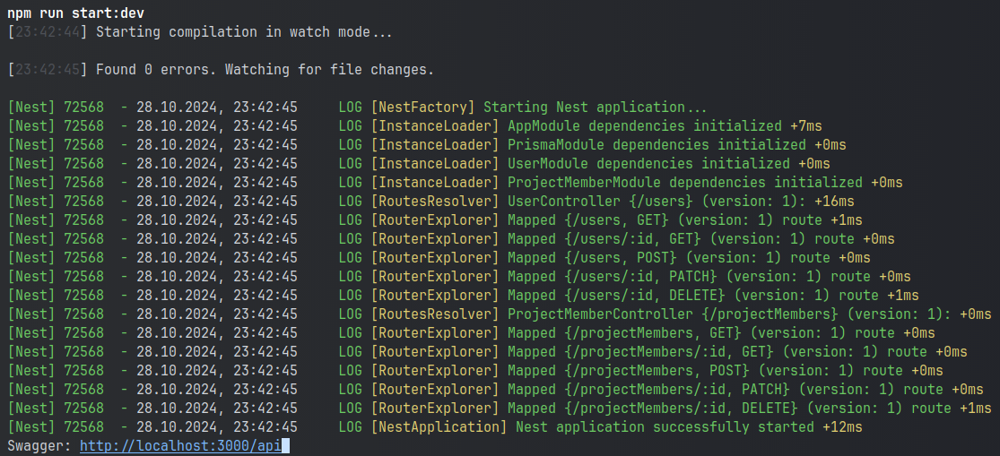

## User

### POST /users

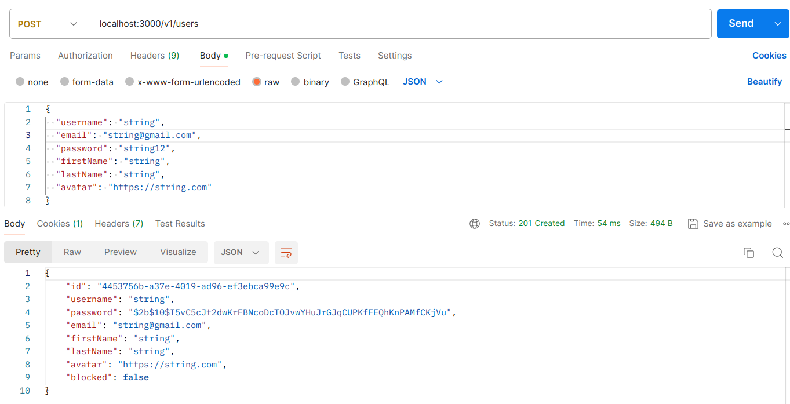

#### InvalidBodyException

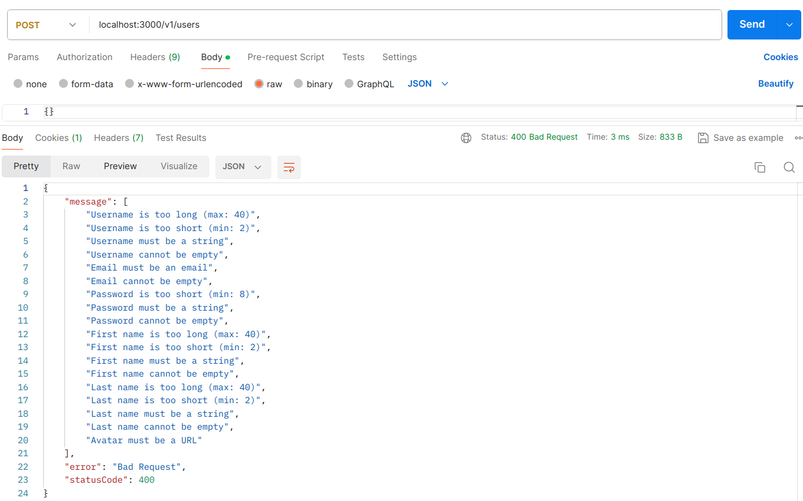

### GET /users

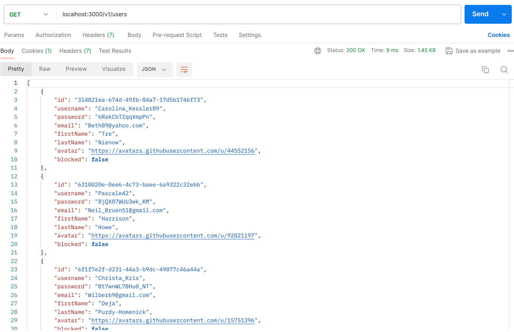

### GET /users/:id

#### InvalidEntityIdException

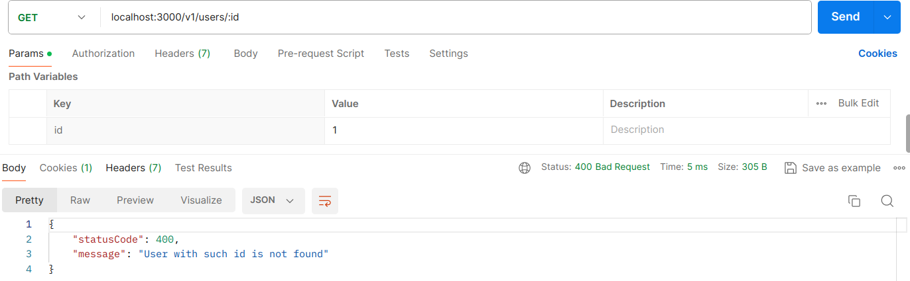

### PATCH /users/:id

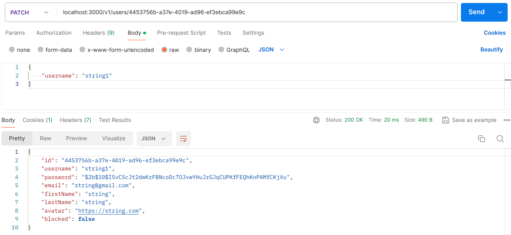

#### InvalidEntityIdException

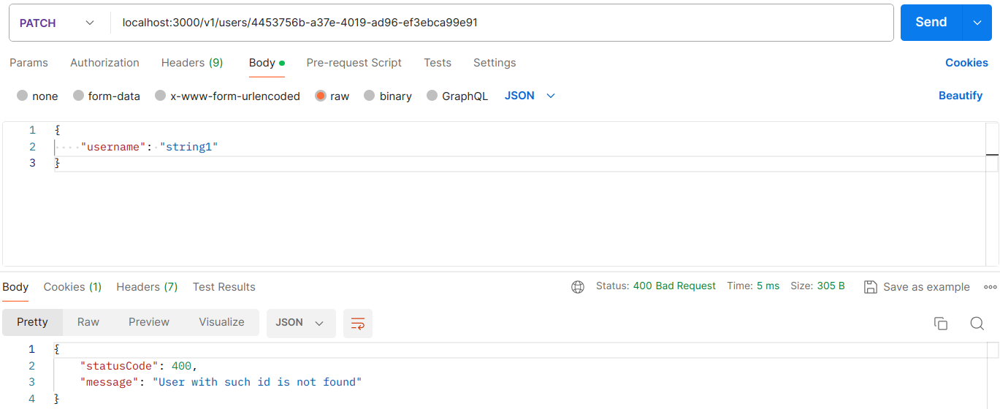

#### InvalidBodyException

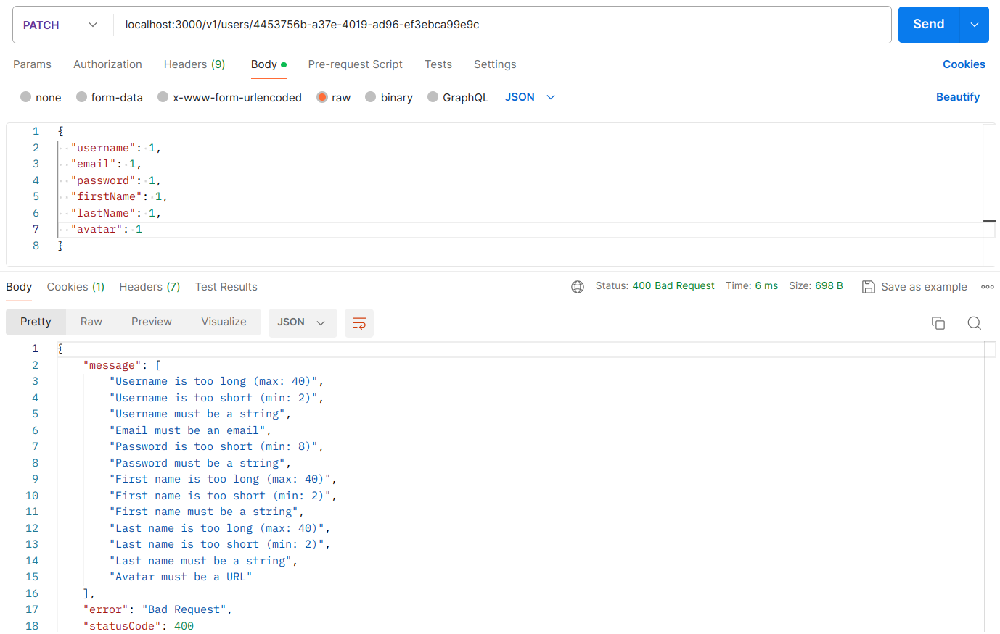

### DELETE /users/:id

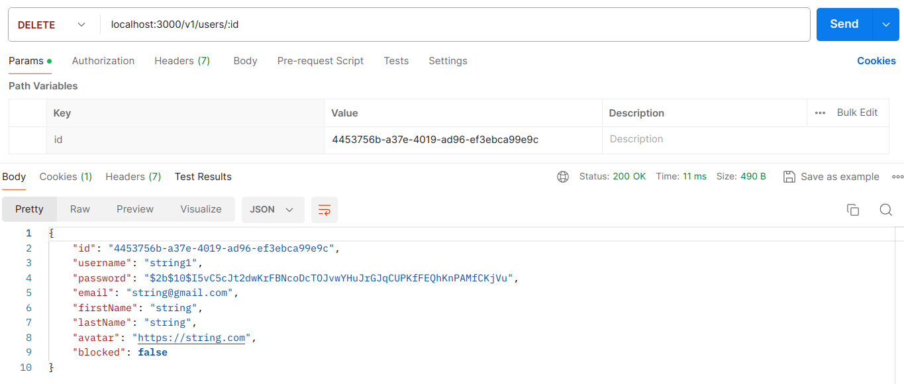

#### InvalidEntityIdException

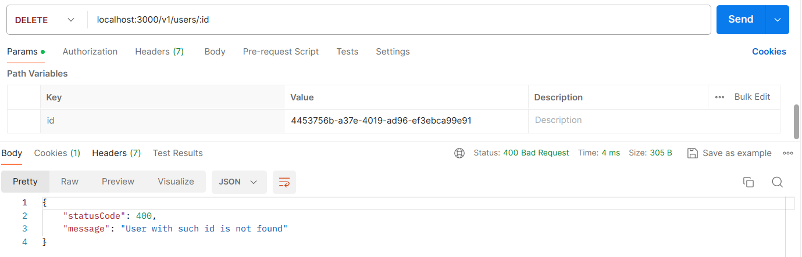

## ProjectMember

### POST /projectMember

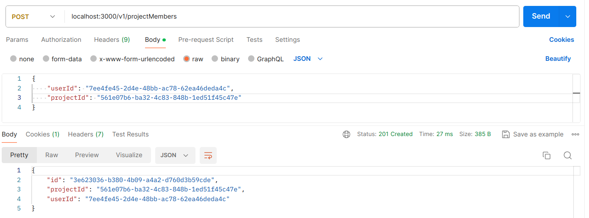

#### AlreadyInProjectException

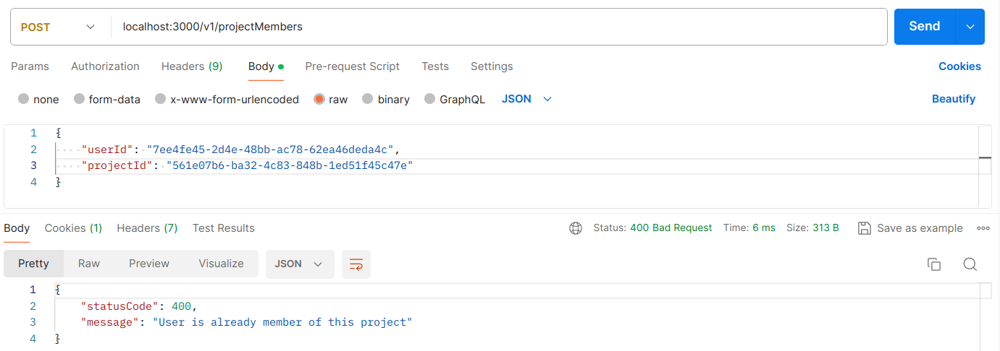

#### InvalidEntityIdException

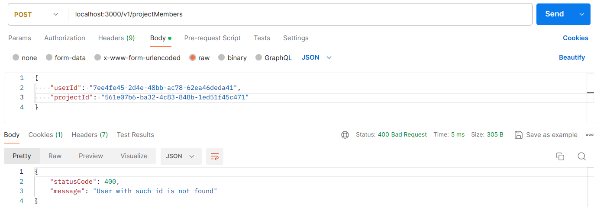

#### InvalidBodyException

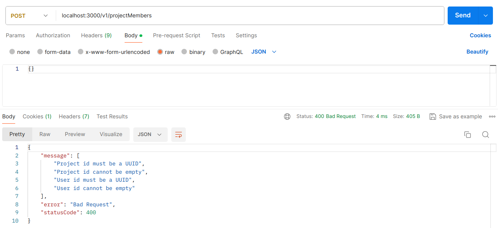

### GET /projectMember

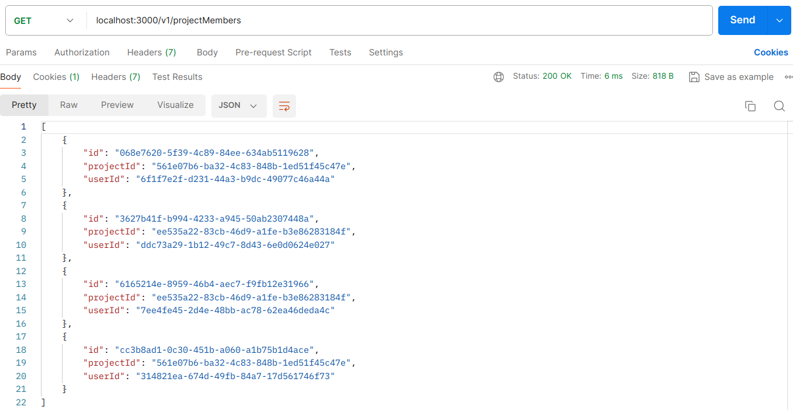

### GET /projectMember/:id

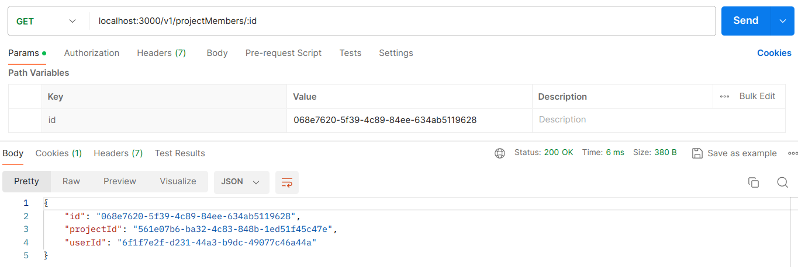

#### InvalidEntityIdException

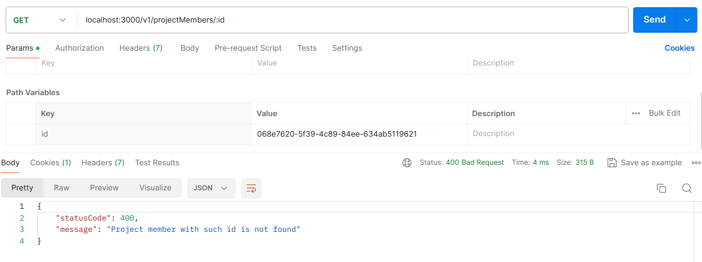

### PATCH /projectMember/:id

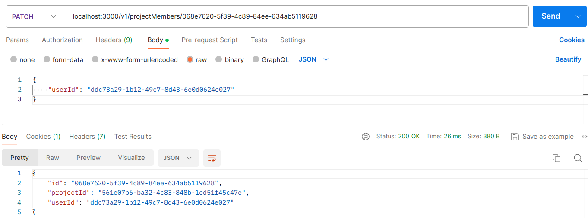

#### InvalidEntityIdException

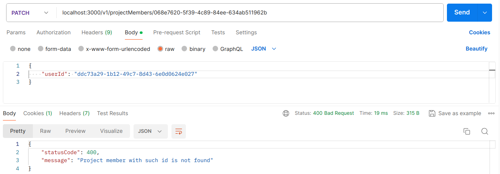

#### InvalidBodyException

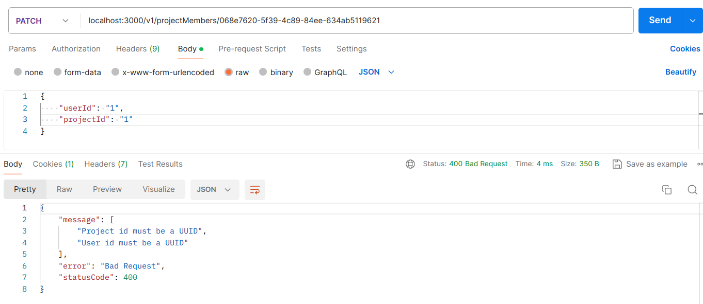

### DELETE /projectMember/:id

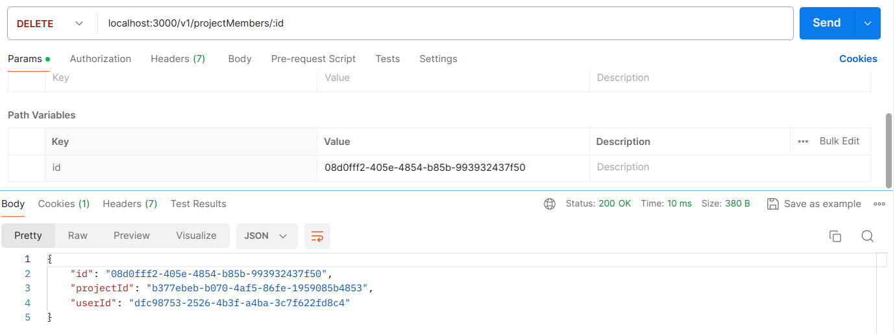

#### InvalidEntityIdException

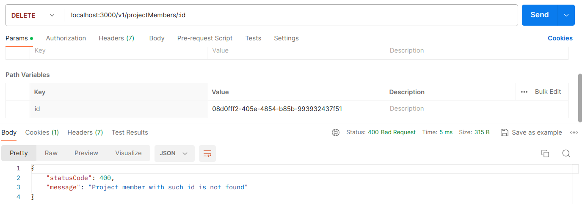
